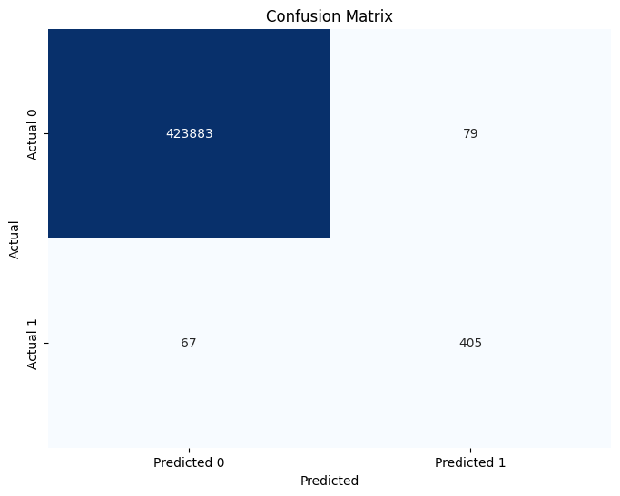
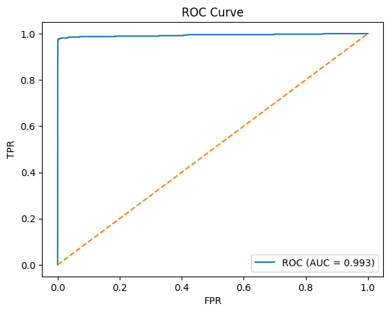
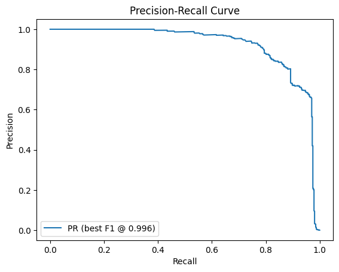

# 🕵️ Real-Time Fraud Detection (Notebook + CSV + App + API)

[](https://colab.research.google.com/github/Sagarramteke19/fraud-detection-pipeline/blob/main/notebooks/fraud_detection.ipynb)


End-to-end fraud detection on transactional data:
- **Training pipeline** (EDA-ready CSV → preprocessing → XGBoost → metrics/plots → `results/model.joblib`)
- **Streamlit app** to upload CSV and get **fraud scores + top features**
- **FastAPI** endpoint for JSON scoring
- Notebook for experiments
---
## 📂 Data
- Full dataset is large (>25MB) and not uploaded.
- A sample (`data/Fraud_sample.csv`) is provided for demo purposes.
- Replace with your full dataset locally when training.
---
## 📂 Structure
```yaml
fraud-detection-pipeline/
├─ notebooks/
│  └─ fraud_detection.ipynb          # your notebook (keep as-is)
├─ data/
│  └─ Fraud.csv                      # your dataset (keep as-is)
├─ src/
│  ├─ train.py                       # TRAIN: reads CSV, trains, exports model + plots
│  ├─ utils.py                       # schema, load/save helpers, threshold tuning
│  ├─ streamlit_app.py               # APP: upload CSV → score + insights
│  └─ app.py                         # API: FastAPI /predict
├─ results/
│  └─ (created at runtime: model.joblib, metrics.json, plots)
├─ docs/
│  └─ DATA_DICTIONARY.md             # (fill from your txt)
├─ requirements.txt
├─ .gitignore
├─ LICENSE
└─ README.md
---


🚀 Quickstart
```bash
pip install -r requirements.txt

# Train & export model + plots to results/
python src/train.py --data data/Fraud.csv --results_dir results --model xgb --seed 42

# Streamlit demo (upload CSV to score)
streamlit run src/streamlit_app.py

# FastAPI (local)
uvicorn src.app:app --reload
---

```
## 📊 Visualizations

### Confusion Matrix


### ROC Curve


### Precision-Recall Curve


### Feature Importance (XGBoost)
.png)

